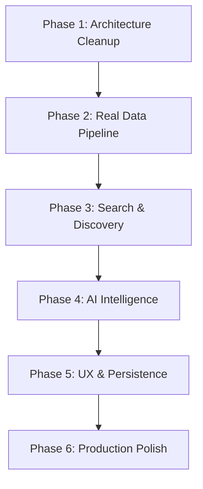

# PriceWise — Production-Ready Implementation Plan

Transform PriceWise from a polished UI prototype into a fully functional, production-grade smart shopping application with real data, AI intelligence, and premium UX.

---

## Current State Assessment

### ✅ What's Already Built (Solid Foundation)
- **Premium UI Shell**: Beautiful dark/light mode, glassmorphism, Framer Motion animations, responsive layout
- **Multi-page SPA**: Landing, Search, Dashboard, Compare, Pricing, Settings — all routed via `react-router-dom`
- **Server Architecture**: Express backend with Vite dev middleware + production static serving
- **Gemini AI Integration**: `gemini-service.ts` with search grounding, alternatives, and review synthesis
- **Firebase Auth + Firestore**: Google sign-in, tracked products CRUD, real-time watchlist subscription
- **Component Library**: 16 polished components (ProductCard, Watchlist, PriceHistoryChart, CompareModal, etc.)
- **Type System**: Comprehensive TypeScript types for all entities

### ❌ Critical Gaps Preventing Production Use

| Gap | Impact |
|-----|--------|
| **Search calls Gemini service directly from SearchPage** (client-side import) | Exposes API key, bypasses server — broken in production |
| **`App.tsx` (970 lines) is a dead duplicate** | Contains full homepage + auth logic but **nothing uses it** (router renders `MainLayout` → pages) |
| **Mock fallbacks dominate** | `generateMerchantDeals()`, `generateMockPriceHistory()`, `getMockAlternatives()` return fabricated data |
| **No real scraping or price data** | Gemini search grounding can hallucinate prices; no actual API or scraper fetches real e-commerce data |
| **Price history is generated, not tracked** | `generateMockPriceHistory()` creates fake deterministic curves instead of storing actual price observations |
| **SearchPage imports server-only code** | `import { performProductSearch } from '../gemini-service'` — this module requires `process.env` and won't work in browser |
| **Compare page uses `require()`** | `require("../firebase-service")` — CommonJS in a Vite ESM project |
| **No search history persistence** | `SearchHistoryEntry` type exists but is never used |
| **No error boundaries or loading states** | Network failures show blank screens |
| **Settings page is non-functional** | Form exists but doesn't persist preferences |

---

## User Review Required

> [!IMPORTANT]
> **Real Price Scraping Strategy**: Since Amazon/Flipkart actively block scraping, I plan to rely **primarily on Gemini's search grounding** (which uses Google Search under the hood) for real-time pricing, supplemented by a structured server-side caching layer. This gives you *real* data without legal/ToS issues. Is this acceptable, or do you want me to integrate specific third-party price comparison APIs (e.g., PriceHistory.in API, Google Shopping API)?

> [!IMPORTANT]  
> **The legacy `App.tsx` (970 lines)**: This is a complete dead file — the router uses `MainLayout` → individual pages instead. I'll **delete it** to avoid confusion. Please confirm you're okay with this.

> [!WARNING]
> **Firebase Config**: Your `firebase-applet-config.json` contains a live API key. This is normal for client-side Firebase, but I'll ensure Firestore security rules remain strict. The current rules look solid.

## Open Questions

> [!IMPORTANT]
> **Deployment Target**: Are you deploying to Firebase Hosting + Cloud Run, or a different platform (Vercel, Railway, etc.)? This affects the build pipeline.

> [!IMPORTANT]
> **Do you have a `.env` file with a real `GEMINI_API_KEY`?** The Gemini search grounding + AI features won't work without it. I'll need you to create one before testing.

> [!IMPORTANT]
> **Clerk Auth**: The codebase has a simulated "Clerk" sign-in that writes a fake user to localStorage. Should I **remove this** and keep only Google Auth, or do you plan to actually integrate Clerk?

---

## Proposed Changes

### Phase 1: Architecture Cleanup & Server Hardening

Fix the broken client/server boundary and eliminate dead code.

---

#### [DELETE] [App.tsx](file:///c:/Users/aryan/Documents/antigravity/pricewise/src/App.tsx)
- Remove the 970-line dead component — it duplicates functionality already in `LandingPage`, `Header`, `MainLayout`, and `Watchlist`
- Nothing imports or references this file

#### [MODIFY] [gemini-service.ts](file:///c:/Users/aryan/Documents/antigravity/pricewise/src/gemini-service.ts)
- **Split into two files**: Server-only AI service (`server/gemini-service.ts`) and shared utilities
- Move `generateMockPriceHistory()` and `generateMerchantDeals()` into a shared `utils/price-utils.ts` (these are pure functions used on both sides)
- Keep all Gemini API calls strictly server-side

#### [NEW] `src/services/api-client.ts`
- Create a typed API client that all frontend code uses to call the Express backend
- Methods: `searchProducts(query)`, `getAlternatives(product)`, `getReviewSummary(product)`, `getAIComparison(productA, productB)`
- Proper error handling, retry logic, and TypeScript response types
- Replaces all direct imports of `gemini-service.ts` from frontend code

#### [MODIFY] [server.ts](file:///c:/Users/aryan/Documents/antigravity/pricewise/server.ts)
- Add rate limiting middleware (in-memory, simple token bucket)
- Add response caching layer (in-memory LRU cache with TTL) for search results
- Add a new `/api/compare` endpoint for AI-powered side-by-side comparison
- Add request validation and sanitization
- Add proper CORS configuration
- Add structured logging

---

### Phase 2: Real Data Pipeline

Replace mocks with real, validated data from Gemini Search Grounding.

---

#### [MODIFY] `server/gemini-service.ts` (renamed from `src/gemini-service.ts`)
- **Enhance `performProductSearch()`**: 
  - Improve the Gemini prompt to request more structured, verifiable data
  - Add validation layer: reject results with obviously fabricated prices (₹0, ₹99999999)
  - Add URL validation: ensure returned URLs are actual domain patterns (amazon.in/dp/..., flipkart.com/...)
  - Normalize platform names to a canonical set
  - Cache results per query for 15 minutes to reduce API calls
- **Enhance `retrieveSmarterAlternatives()`**:
  - Improve prompt to include specific comparison criteria (specs, warranty, brand reputation)
  - Add structured pros/cons for each alternative
  - Request reasoning with confidence scores
- **Enhance `summarizeAiReviews()`**:
  - Use search grounding to pull actual review sentiments from the web
  - Structure output with sentiment scores per category (build quality, performance, value, etc.)

#### [NEW] `server/price-tracker.ts`
- Cron-style function to re-check prices for all tracked products
- Compares new prices against stored `currentPrice` and `targetPrice`
- Updates Firestore `priceHistory` array with real observations
- Generates notifications when price drops below target

#### [NEW] `server/url-parser.ts`
- Advanced URL parser for Amazon and Flipkart product links
- Extract ASIN (Amazon) or product ID (Flipkart) from URLs
- Support for shortened URLs, mobile URLs, affiliate URLs
- Use extracted identifiers to enhance Gemini search queries

---

### Phase 3: Search & Discovery (Full Featured)

---

#### [MODIFY] [SearchPage.tsx](file:///c:/Users/aryan/Documents/antigravity/pricewise/src/pages/SearchPage.tsx)
- **Remove direct import of `gemini-service.ts`** — use the new `api-client.ts` instead
- Add URL detection: when user pastes a link, show a specialized "URL Analysis" mode
- Add search history dropdown (last 10 searches, persisted to localStorage)
- Wire up the "Compare Now" button to navigate to `/compare`
- Add pagination/infinite scroll for results
- Add "Track This Price" quick-action button on each result card (opens target price modal)
- Show loading skeleton animations during search
- Add error state with retry button

#### [MODIFY] [SearchFilters.tsx](file:///c:/Users/aryan/Documents/antigravity/pricewise/src/components/SearchFilters.tsx)
- Initialize price range dynamically from actual search results
- Add platform filter checkboxes from actual returned platforms
- Add "In Stock Only" toggle
- Persist filter preferences to localStorage

#### [MODIFY] [ProductCard.tsx](file:///c:/Users/aryan/Documents/antigravity/pricewise/src/components/ProductCard.tsx)
- Add "Quick Track" button (heart icon → opens target price input)
- Show deal score badge (calculated from price vs original price)
- Add "View on Store" external link button
- Improve image fallback with category-specific placeholder logic
- Add skeleton loading state variant

---

### Phase 4: AI Intelligence Features (The Core Differentiator)

---

#### [MODIFY] [ProductDetailModal.tsx](file:///c:/Users/aryan/Documents/antigravity/pricewise/src/components/ProductDetailModal.tsx)
- Wire up the AI Review Summary tab to call `/api/reviews` via `api-client.ts`
- Wire up "Smarter Alternatives" tab to call `/api/alternatives` via `api-client.ts`
- Show real pros/cons with clear visual indicators (green checkmarks / red warnings)
- Add "AI Verdict" card with buy/wait recommendation
- Show merchant deal comparison table with real data
- Add price history chart (using tracked data if available, Gemini estimate if not)
- Add share button (copy product + price to clipboard)

#### [MODIFY] [ComparePage.tsx](file:///c:/Users/aryan/Documents/antigravity/pricewise/src/pages/ComparePage.tsx)
- **Fix the `require()` call** — replace with proper ESM import
- Add a new `/api/compare` endpoint call that generates AI head-to-head analysis
- Show category-by-category comparison (Performance, Build, Value, Ecosystem)
- Add "Winner" badge on the recommended product
- Real price history overlay chart (not mock)

#### [MODIFY] [AIChatPanel.tsx](file:///c:/Users/aryan/Documents/antigravity/pricewise/src/components/AIChatPanel.tsx)
- Connect to a new `/api/chat` endpoint for conversational shopping assistance
- Support contextual queries: "Is the iPhone 16 Pro worth it over the 15 Pro?"
- Show product cards inline in chat responses
- Add typing indicator with "Gemini is thinking..." animation

#### [NEW] `server/routes/chat.ts`
- New API endpoint for Gemini-powered shopping chat
- System prompt configured as a knowledgeable shopping advisor for Indian e-commerce
- Context-aware: knows user's watchlist and search history
- Structured responses with inline product recommendations

---

### Phase 5: User Experience & Persistence

---

#### [MODIFY] [DashboardPage.tsx](file:///c:/Users/aryan/Documents/antigravity/pricewise/src/pages/DashboardPage.tsx)
- Replace deterministic mock insights with real AI analysis from `/api/alternatives` and `/api/reviews`
- Show actual savings calculated from price history (tracked initial price vs current lowest)
- Add "Refresh Prices" button that triggers a re-scan of all tracked items
- Show recent search history section
- Add quick-search bar within dashboard

#### [MODIFY] [Watchlist.tsx](file:///c:/Users/aryan/Documents/antigravity/pricewise/src/components/Watchlist.tsx)
- Add price trend indicator (arrow up/down based on last 2 price observations)
- Add "Target Hit!" visual indicator when current price ≤ target price
- Add swipe-to-delete on mobile
- Add sorting options (by price, by date added, by price drop %)

#### [MODIFY] [SettingsPage.tsx](file:///c:/Users/aryan/Documents/antigravity/pricewise/src/pages/SettingsPage.tsx)
- **Actually persist preferences to Firestore** under `userPreferences/{userId}`
- Wire up theme toggle to context
- Wire up currency selector (INR/USD) 
- Wire up notification preferences
- Add account info display (email, display name, avatar)
- Add "Export Data" button (download watchlist as CSV)
- Add "Delete Account" with confirmation dialog

#### [MODIFY] [firebase-service.ts](file:///c:/Users/aryan/Documents/antigravity/pricewise/src/firebase-service.ts)
- Add `saveUserPreferences()` and `getUserPreferences()` functions
- Add `saveSearchHistory()` function
- Add `exportWatchlistCSV()` function
- Update `trackProduct()` to initialize with actual price data (not mock history)

#### [MODIFY] [firestore.rules](file:///c:/Users/aryan/Documents/antigravity/pricewise/firestore.rules)
- Add rules for `userPreferences/{userId}` collection
- Add rules for `searchHistory/{userId}/entries/{entryId}` collection
- Maintain strict user-scoped access patterns

---

### Phase 6: Production Readiness & Polish

---

#### [NEW] `src/components/ErrorBoundary.tsx`
- React error boundary wrapper with premium-styled fallback UI
- "Something went wrong" card with retry button
- Logs errors to console with component stack trace

#### [NEW] `src/hooks/useDebounce.ts`
- Debounce hook for search input (300ms delay)
- Prevents excessive API calls while typing

#### [NEW] `src/hooks/useLocalStorage.ts`
- Type-safe localStorage hook for persisting search history, filter preferences, theme

#### [MODIFY] [index.html](file:///c:/Users/aryan/Documents/antigravity/pricewise/index.html)
- Add proper `<title>`, `<meta description>`, Open Graph tags
- Add favicon
- Add preconnect hints for Google Fonts and Firebase

#### [MODIFY] [LandingPage.tsx](file:///c:/Users/aryan/Documents/antigravity/pricewise/src/pages/LandingPage.tsx)
- Add animated counter stats section ("10K+ products tracked", "₹2Cr+ saved", etc.)
- Add FAQ accordion section
- Add platform comparison grid showing which platforms are supported

#### [MODIFY] [Header.tsx](file:///c:/Users/aryan/Documents/antigravity/pricewise/src/components/Header.tsx)
- Add active route highlighting on nav links
- Add mobile hamburger menu for smaller screens
- Add search shortcut (Ctrl+K to focus search)

#### [MODIFY] [Footer.tsx](file:///c:/Users/aryan/Documents/antigravity/pricewise/src/components/Footer.tsx)
- Ensure all links work
- Add links to all pages (Search, Dashboard, Compare, Pricing, Settings)

#### [MODIFY] [PricingPage.tsx](file:///c:/Users/aryan/Documents/antigravity/pricewise/src/pages/PricingPage.tsx)
- Make the free tier fully functional (current feature set)
- Add feature comparison table
- Add FAQ section about tiers

---

## Execution Order



| Phase | Estimated Files Changed | Priority |
|-------|------------------------|----------|
| Phase 1: Architecture Cleanup | 5 files + 1 new + 1 delete | 🔴 Critical |
| Phase 2: Real Data Pipeline | 3 files + 2 new | 🔴 Critical |
| Phase 3: Search & Discovery | 3 files modified | 🟡 High |
| Phase 4: AI Intelligence | 4 files + 1 new | 🟡 High |
| Phase 5: UX & Persistence | 5 files modified | 🟢 Medium |
| Phase 6: Production Polish | 6 files + 3 new | 🟢 Medium |

---

## Verification Plan

### Automated Tests
```bash
# TypeScript compilation check
npx tsc --noEmit

# Dev server startup test
npm run dev
```

### Manual Verification
- Search for "iPhone 16 Pro" → verify real results from Gemini with actual prices
- Paste an Amazon URL → verify product extraction and cross-platform comparison
- Sign in with Google → track a product → verify it appears in Dashboard watchlist
- Open Product Detail → verify AI reviews show real pros/cons
- Open Compare page → verify AI head-to-head analysis works
- Test Settings page → verify preferences persist across page reloads
- Test dark/light mode toggle → verify consistency across all pages
- Test mobile responsive layout on Chrome DevTools
- Verify all navigation links work (no dead routes)
- Test error states (disconnect network → verify graceful fallbacks)
